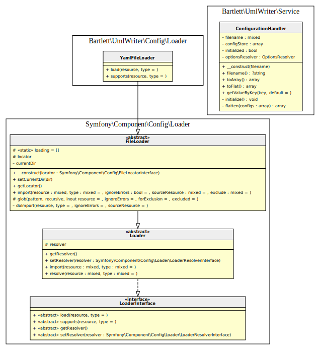

[TOC]
UmlWriter 2.0 can be configured in two ways (YAML file or console command arguments).
Without changes, following defaults will be applied.

## Defaults

| Option          | Value    | Default  | Description                                                                                                                |
|-----------------|----------|----------|----------------------------------------------------------------------------------------------------------------------------|
| show_constants  | boolean  | true     | whether to show class constants as readonly static variables (or just omit them completely)                                |
| show_properties | boolean  | true     | whether to show class properties                                                                                           |
| show_methods    | boolean  | true     | whether to show class or interface methods                                                                                 |
| show_private    | boolean  | true     | whether to also show private methods/properties                                                                            |
| show_protected  | boolean  | true     | whether to also show protected methods/properties                                                                          |
| add_parents     | boolean  | true     | whether to show add parent classes or interfaces                                                                           |
| only_self       | boolean  | true     | whether to only show methods/properties that are actually defined in this class <br/> (and not those merely inherited from base) |
| label_format    | string   | record   | whether to use html or record formatted labels (graphviz specific feature).<br/> Others generator may have different values      |
| indent_string   | string   | '  '     | string to indent graph statement parts (two blanks)                                                                                    |
| paths           | array    | ['src']  | data source (file or directory) to parse                                                                                   |
| generator       | string   | graphviz | identification returned by `getName()` method <br/> of a class implementing `Bartlett\GraphUml\Generator\GeneratorInterface` |
| graph.name      | string   | G        | name of the graph                                                                                                          |
| graph.overlap   | boolean  | false    | determines if and how node overlaps should be removed. <br/> More details at http://graphviz.org/doc/info/attrs.html#d:overlap |
| graph.rankdir   | string   | TB       | sets direction of graph layout (Top to Bottom). <br/> See http://graphviz.org/doc/info/attrs.html#d:rankdir                |
| node.fontname   | string   | Verdana  | font name to use to draw node of the graph                                                                                 |
| node.fontsize   | integer  | 8        | font size to draw node of the graph                                                                                        |
| node.shape      | string   | none     | set the shape of nodes                                                                                                     |
| node.margin     | integer  | 0        | see http://graphviz.org/doc/info/attrs.html#d:margin for details                                                           |
| node.fillcolor  | string   | #FEFECE  | color used to fill background color of nodes. <br /> See http://graphviz.org/doc/info/attrs.html#d:fillcolor               |
| node.style      | string   | filled   | see http://graphviz.org/doc/info/attrs.html#d:style                                                                        |
| edge.fontname   | string   | Verdana  | font name to use to draw edge of the graph                                                                                 |
| edge.fontsize   | integer  | 8        | font size to draw edge of the graph                                                                                        |

## Console command

See all arguments and options details in [Console Commands](../02_Console_Commands/diagram_class.md) section.

## YAML file (example)

Attributes to configure graph (node, edge, cluster) may be find at:
- https://graphviz.gitlab.io/_pages/doc/info/attrs.html

And to configure colors for graphviz and plantuml generators:
- https://graphviz.gitlab.io/_pages/doc/info/colors.html
- https://plantuml.com/en/color

```yaml
parameters:
    generator: graphviz

    graph:
        name: G
        overlap: 'false'
        rankdir: LR
        bgcolor: transparent

    node:
        fillcolor: '#FEFECE'
        style: filled

    edge: ~

    cluster:
        Bartlett\UmlWriter\Console:
            graph:
                bgcolor: BurlyWood
        Symfony\Component\Console:
            graph:
                bgcolor: LightSteelBlue
        Symfony\Contracts\Service:
            graph:
                bgcolor: LightSteelBlue

    paths:
        - src/

    show_constants: true
    show_properties: true
    show_methods: true
    show_private: false
    show_protected: false

```

## Architecture


