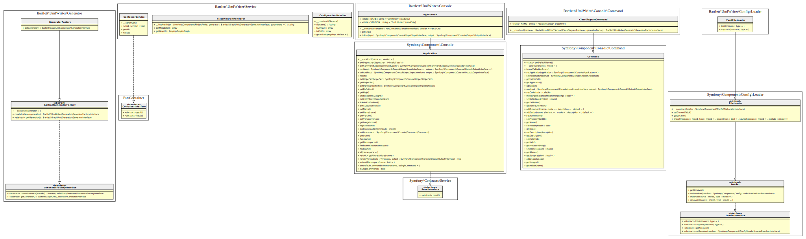

Generate UmlWriter graph architecture with only public elements and default render options.
When you're in project folder, invoke `diagram:class` command with following arguments:

```bash
bin/umlwriter diagram:class src/ --hide-private --hide-protected
```

Will output this [graph statements](./01_UmlWriter_public_architecture.gv) and image look like


