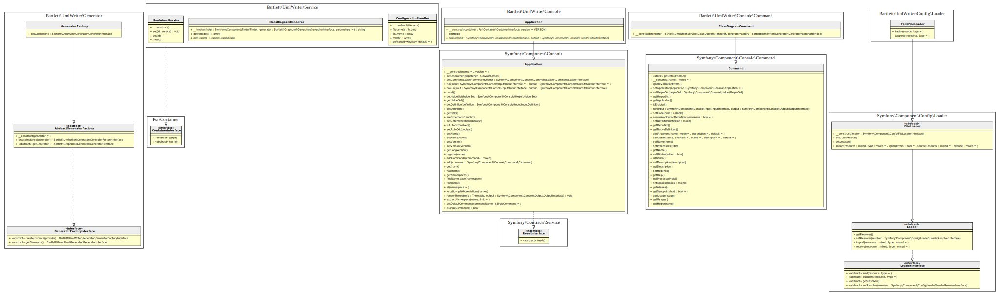

Generate UmlWriter graph architecture with only public methods and default render options.
When you're in project folder, invoke `diagram:class` command with following arguments:

```bash
bin/umlwriter diagram:class src/ --hide-private --hide-protected --without-constants --without-properties
```

Will output this [graph statements](./02_UmlWriter_public_methods_only.gv) and image look like


