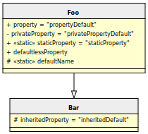

In this example we need a custom autoloader to load non standard classes

```php
/** @var \Composer\Autoload\ClassLoader $loader */
$loader = require dirname(__DIR__, 2) . '/vendor/autoload.php';
$loader->addClassMap(
    [
        'Name\\Space\\Foo' => __DIR__ . '/reflection-properties.php',
        'Name\\Space\\Bar' => __DIR__ . '/reflection-properties.php',
    ]
);
```

Our data source is only one file: `reflection-properties.php` with such contents

```php
namespace Name\Space;

class Bar
{
    protected $inheritedProperty = 'inheritedDefault';
}

class Foo extends Bar
{
    public $property = 'propertyDefault';
    private $privateProperty = 'privatePropertyDefault';
    public static $staticProperty = 'staticProperty';
    public $defaultlessProperty;
    protected static $defaultName;
}
```

When you're in project folder, invoke `diagram:class` command with following arguments:

```bash
bin/umlwriter diagram:class diagram:class examples/autoloader/reflection-properties.php --bootstrap examples/autoloader/classmap.php
```

Will output this [graph statements](./03_Custom_autoloader.gv) and image look like


