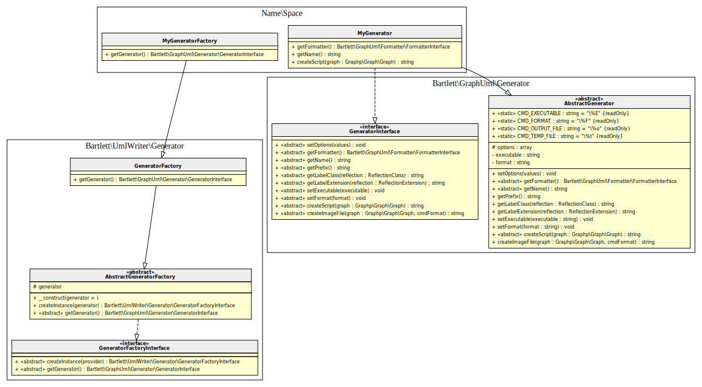

<!-- markdownlint-disable MD013 -->
# Creating a new Generator

You must follow these steps:

## **1.** creates your generator class

This class must have implements the `GeneratorInterface`.

```php
<?php
namespace Name\Space;

use Bartlett\GraphUml\Formatter\FormatterInterface;
use Bartlett\GraphUml\Formatter\HtmlFormatter;
use Bartlett\GraphUml\Generator\AbstractGenerator;
use Bartlett\GraphUml\Generator\GeneratorInterface;

use Graphp\Graph\Graph;

class MyGenerator extends AbstractGenerator implements GeneratorInterface
{
    public function getFormatter(): FormatterInterface
    {
        return new HtmlFormatter($this->options);
    }

    public function getName(): string
    {
        return 'mygenerator';
    }

    public function createScript(Graph $graph): string
    {
        return 'TODO: Implement createScript() method.' . PHP_EOL;
    }
}
```

## **2.** creates your generator factory class

This factory should be able to load your new generator class.

```php
<?php
namespace Name\Space;

use Bartlett\GraphUml\Generator\GeneratorInterface;
use Bartlett\UmlWriter\Generator\GeneratorFactory;

class MyGeneratorFactory extends GeneratorFactory
{
    public function getGenerator(): GeneratorInterface
    {
        if ('mygenerator' === $this->generator) {
            return new MyGenerator();
        }

        // fallback to default GeneratorFactory behavior (checks for GraphViz or PlantUML)
        return parent::getGenerator();
    }
}
```

## **3.** autoloader

Of course your classes must be loadable with your autoloader.

```php
<?php
/** @var \Composer\Autoload\ClassLoader $loader */
$loader = require dirname(__DIR__, 2) . '/vendor/autoload.php';
$loader->addClassMap(
    [
        'Name\\Space\\MyGeneratorFactory' => __DIR__ . '/my-generator-factory.php',
        'Name\\Space\\MyGenerator' => __DIR__ . '/my-generator.php',
    ]
);
```

## **4.** on console command

Now if you want to use the `diagram:class` command, you'll need to modify the application launcher `bin/launcher`
to inject the new generator factory in service container.

```
use Bartlett\UmlWriter\Console\Application;
use Bartlett\UmlWriter\Service\ContainerService;
use Bartlett\UmlWriter\Generator\GeneratorFactoryInterface;
use Name\Space\MyGeneratorFactory;

$container = new ContainerService();
$container->set(GeneratorFactoryInterface::class, new MyGeneratorFactory());

$application = new Application($container);
$application->run();
```

You have then to invoke `bin/launcher diagram:class --generator=mygenerator` command to get results.

## **5.** on batch mode

Alternative way is to use the batch PHP mode.

```php
<?php
require_once __DIR__ . '/classmap.php';

use Bartlett\UmlWriter\Service\ClassDiagramRenderer;
use Name\Space\MyGeneratorFactory;
use Symfony\Component\Finder\Finder;

// path to directory where to find PHP source code
$dataSource = dirname(__DIR__, 2) . '/src';

$finder = new Finder();
$finder->in($dataSource)->name('*.php');

$generatorFactory = new MyGeneratorFactory('mygenerator');
// creates instance of Name\Space\MyGenerator
$generator = $generatorFactory->getGenerator();

$renderer = new ClassDiagramRenderer();
// generates UML class diagram of all objects found in dataSource
$script = $renderer($finder, $generator);
// show UML diagram statements
echo $script;
```

## Architecture


