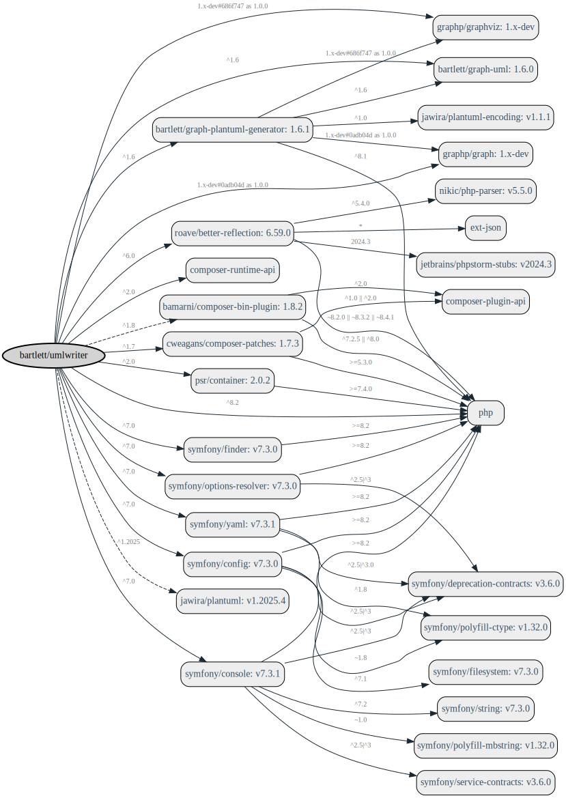

<!-- markdownlint-disable MD013 -->
# About

## Features

The main features provided by this library are:

* Parse one to many PHP file
* Parse one to many directory
* Configuration is handled by a YAML file or console command arguments
* build UML statements of a class diagram
* draw png/svg image formats if backends installed (graphviz, plantuml server)
* two generators provided by default:

|                                     GraphViz |                                     PlantUML |
|---------------------------------------------:|---------------------------------------------:|
|  |  |

Currently, the following language features are supported:

* Property and method visibility
* Static properties and methods
* Method return types natively and from doc comment
* Parameter types from type hinting and doc comment
* Parameter default values
* Class constants with value
* Property types from doc comment
* Property default values
* Implemented interfaces and parent classes
* Abstract classes

## Usage

> Learn more about different usages with console, Docker and programmatically.

See [Getting-Started's Guide](usage/README.md) to know how to use it.

## Installation

> Learn how to install `umlwriter` application in different way.

See [Installation Guide](installation.md)

## Architecture

> As a developer you want to learn more about UMLWriter architecture.

See [Architecture's Guide](architecture/README.md)
