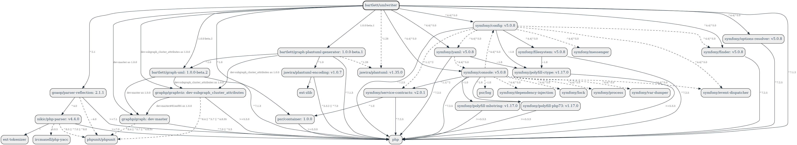

### Features

The main features provided by this library are:

* Parse one to many PHP file
* Parse one to many directory
* Configuration is handle by a YAML file or console command arguments
* build UML statements of a class diagram
* draw png/svg image formats

Currently, the following language features are supported:

* Property and method visibility
* Static properties and methods
* Method return types natively and from doc comment
* Parameter types from type hinting and doc comment
* Parameter default values
* Class constants with value
* Property types from doc comment
* Property default values
* Implemented interfaces and parent classes
* Abstract classes

### Install

The recommended way to install this library is [through composer](http://getcomposer.org).
If you don't know yet what is composer, have a look [on introduction](http://getcomposer.org/doc/00-intro.md).

```bash
composer require bartlett/umlwriter
```



Additionally, you'll have to install GraphViz (`dot` executable) and/or PlantUML jar with Java Runtime (java executable).
Users of Debian/Ubuntu-based distributions may simply invoke:

```bash
$ sudo sudo apt update
$ sudo apt-get install graphviz
$ sudo apt-get install openjdk-11-jre-headless
```

while remaining users should install from [GraphViz Download](http://www.graphviz.org/download/) page
and from [PlantUML Download](https://plantuml.com/fr/download) page.
