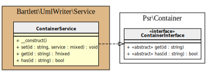

# Architecture

This guide is dedicated to all PHP developers that want to learn more about each UMLWriter components.

## Command Line Runner

`UmlWriter` is a basic Symfony Console Application.

## Configuration

`UmlWriter` assume a zero configuration by default, that you can change to whatever you want.

## Generator

`UmlWriter` provides a factory that is able to build `graphviz` and `plantuml` graph format.

## Service

`UmlWriter` provides a basic and light container service for dependency injection.

