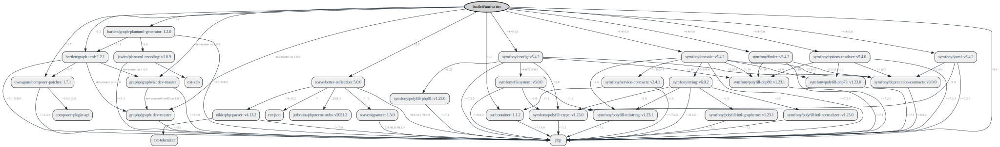

<!-- markdownlint-disable MD013 -->
# Getting started

## Requirements

* PHP 7.1.3 or greater
* [graphp/graph](https://github.com/graphp/graph) package from master branch (considered as future stable v1.0.0)
* [graphp/graphviz](https://github.com/graphp/graphviz) package from master branch (considered as future stable v1.0.0)
* [bartlett/graph-uml](https://github.com/llaville/graph-uml) Core engine to build UML diagrams in PHP
* [bartlett/graph-plantuml-generator](https://github.com/llaville/graph-plantuml-generator) A PlantUML generator for graph-uml.
* [roave/better-reflection](https://github.com/Roave/BetterReflection) the Reflection API



Generated with [fork](https://github.com/markuspoerschke/graph-composer/tree/add-options-to-exclude) of [clue/graph-composer](https://github.com/clue/graph-composer).
Learn more about this fork on [PR request](https://github.com/clue/graph-composer/pull/45).

## Installation

### With Composer

The recommended way to install this library is [through composer](http://getcomposer.org).
If you don't know yet what is composer, have a look [on introduction](http://getcomposer.org/doc/00-intro.md).

```shell
composer require bartlett/umlwriter ^2.0
```

### With Git

The UmlWriter can be directly used from [GitHub](https://github.com/llaville/umlwriter.git)
by cloning the repository into a directory of your choice.

```shell
git clone -b 2.x https://github.com/llaville/umlwriter.git
```

Additionally, you'll have to install GraphViz (`dot` executable) and/or PlantUML jar with Java Runtime (java executable).
Users of Debian/Ubuntu-based distributions may simply invoke:

```bash
sudo apt update
sudo apt-get install graphviz
sudo apt-get install openjdk-11-jre-headless
```

while remaining users should install from [GraphViz Download](http://www.graphviz.org/download/) page
and from [PlantUML Download](https://plantuml.com/fr/download) page.
